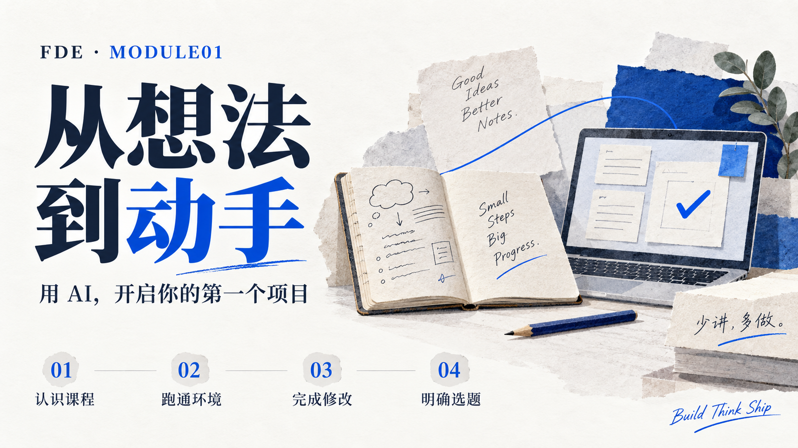

## 这个模块做什么

**用 AI，开启你的第一个项目。**

学过编程，也用过 AI。现在，让它们一起帮你完成一件具体的事。

从这个模块开始，我们围绕一个「个人学习笔记本」，把项目启动的第一步走通：知道要解决什么问题，在自己的电脑上跑起代码，借助 AI 完成一处修改，再写清第一版准备做什么。

本模块对应 C101—C104 四次课，是整门课的起点。后续我们会持续迭代同一个项目，逐步加入整理、检索与资料问答，完整路线会随课程逐步展开。

## 学习顺序

| 环节 | 你会做的事 | 留下的结果 |
| --- | --- | --- |
| [C101 · 认识 FDE 与课程](./C101.认识FDE与课程.md) | 看懂从问题到交付的工作方式，了解这一学期怎样做项目、怎样使用 AI | 能说清课程目标，以及自己想用笔记本解决的一个问题 |
| [C102 · 跑通开发环境](./C102.开发环境.md) | 准备 WorkBuddy、VS Code、Node.js 与 Git，在自己的电脑上检测并运行 | 一份环境检查记录和真实运行结果 |
| [C103 · 完成第一次修改](./C103.基础知识.md) | 找到文件，向 AI 交代一个小任务，亲手检查结果，用 Markdown 留下说明 | 一处自己的修改和一份可复验的操作记录 |
| [C104 · 确定项目切入点](./C104.确定选题.md) | 观察一次 Skill 调研演示，比较已有做法，缩小第一版范围 | 一份笔记产品立项与需求初稿 |

## 学完以后，你要能做到

- **能启动：** 找到项目目录，执行命令，看到真实输出；遇到报错时，能准确说明卡在哪里。
- **能协作：** 告诉 AI 这次改什么、改到什么程度，并打开文件、运行程序核对结果。
- **能记录：** 用 Markdown 写下目标、修改和验证，让同学能够照着说明再做一次。
- **能取舍：** 说清为谁做、解决什么问题、已有方案是什么，以及第一版准备做到哪里。

不必一开始就懂所有技术。先完成一件小事，再从实际问题里找到下一个学习入口。

## 带走三份具体成果

1. **环境与运行记录：** Node.js、npm、Git 的检测输出，以及一次成功运行的证据。
2. **第一次修改记录：** 改了哪个文件、为什么改、怎样验证；说明 AI 帮了什么，自己判断了什么。
3. **项目需求初稿：** 写清用户、场景、问题与第一版范围，列出一个保留功能、一个暂缓功能和一个待验证问题。

拿到课程骨架后，继续把这些操作用在普通笔记本 V0 上，检查新建、查看、编辑、保存和刷新。只有脚本运行成功时，才记录环境练习完成；笔记本功能仍需实际验证。具体操作与验收见 [C102](./C102.开发环境.md) 和 [C103](./C103.基础知识.md)。

## 开始前，准备好两样东西

- **一台能上网的笔记本电脑：** 带好电源，确认自己能够安装软件。课程选用的 AI 工具是 WorkBuddy，提前在官网注册：[WorkBuddy 下载与注册](https://www.workbuddy.cn/events/invite?inviteCode=nfv4wxkzzy2xhvx)；高校学生还可以完成[高校认证](https://www.workbuddy.cn/events/campus-freshman/)领取积分。
- **一个真实的小困扰：** 例如「编程报错散在聊天记录里，下次遇到还得重新找」，或「记了很多课程笔记，复习时找不到重点」。

带着这个问题来。我们会先让代码跑起来，再让你的想法有一个可以继续做下去的起点。

**少讲，多做。把学过的东西，串起来、用起来、做出来。**
